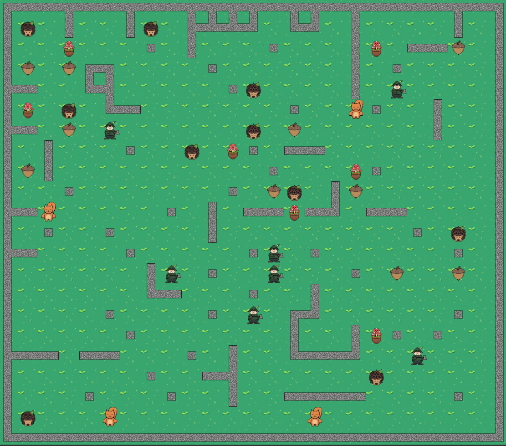
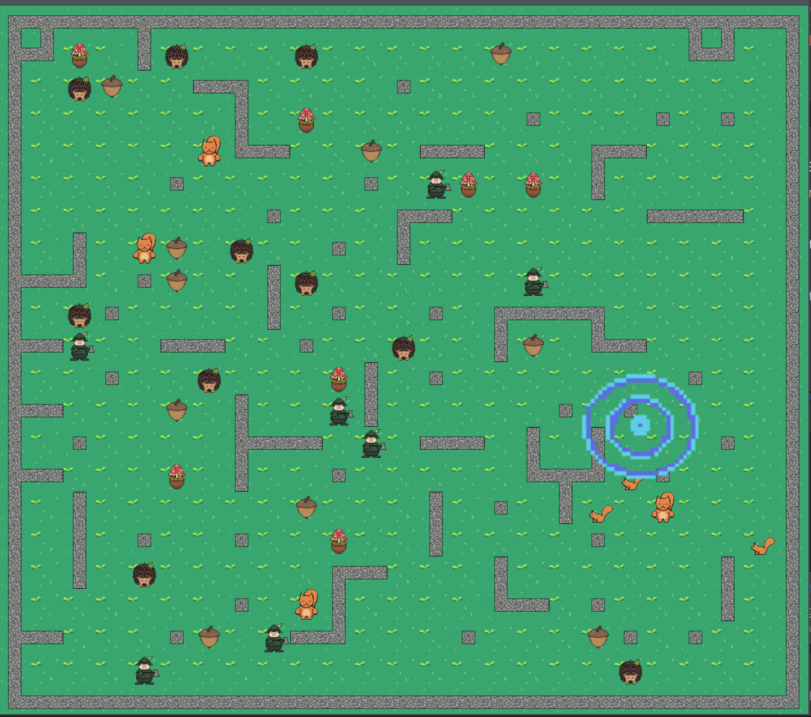

# Squirrel_StrategyGame

- Development and design of a strategy game.
- Various entities can be present on the game board.
- Each player in the game controls a squirrel, which needs to collect food to gain energy. It can collect food, and thus energy, either from plants or from enemy squirrels.
- Squirrels can also lose energy upon contact with certain entities.

---

## Game UI:

The finished game looks like this:

The game environment consists of the following elements:

- Player-controlled Squirrel: Controlled using the keyboard inputs A, S, D, W.
- Squirrel Bot: Scans for the nearest entities, accounting for potential threats and optimizing its path.
- Chestnuts: Grant the squirrel +200 life upon collection.
- Hedgehog: Provides the squirrel with +100 life upon collection.
- Hunter: Pursues the squirrel upon sighting and inflicts a -150 life penalty upon contact.
- Mushroom: Results in a -100 life deduction from the squirrel upon collection.

---

## Important note:
- The graphics of the various entities are missing

